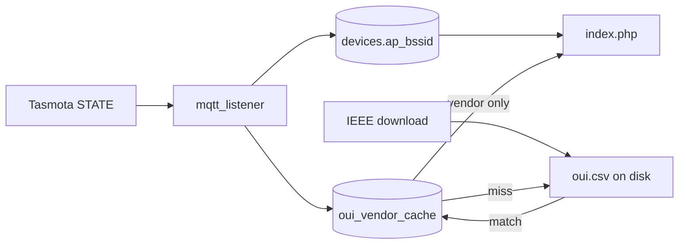

# AP vendor under LAN IP (IEEE file + lazy DB cache)

## Goal

- Persist **AP BSSID** per device (internal only; not shown in UI).
- Derive **OUI** = first 3 octets → **6 hex digits** (no colons), lookup key.
- **IEEE file only:** Keep [MA-L oui.csv](http://standards-oui.ieee.org/oui/oui.csv) on disk under a configurable directory. **Download** when **missing** or **stale** (`filemtime` older than `$ieee_oui_max_age_seconds`).
- **No full import** of the CSV into MySQL. **Lookup:** `SELECT` from `oui_vendor_cache` by `oui`. On **miss**, **open the CSV and scan** (stream with `fgetcsv`, match normalized **Assignment** column to target OUI, read **Organization Name**). On success or definitive “not in file”, **INSERT** a row into `oui_vendor_cache` so **that OUI is never file-scanned again** (until cache invalidation—see below).
- [index.php](/home/JamieDev/web/tasmotaportal-dev.stuckbendix.com/public_html/index.php): under LAN IP, show **vendor name only** when cache has a **non-empty** vendor; if cached as unknown, show nothing.

## Cache invalidation

When `ensure_ieee_oui_csv()` **successfully replaces** the file with a **new download**, **truncate `oui_vendor_cache`** (or `DELETE` all rows) so vendor strings and “not found” markers stay consistent with the new IEEE snapshot. Lazy repopulation happens again on demand.

If you prefer **not** to drop cache on refresh, you could instead store `source_csv_mtime` per row and re-scan when stale—more complex; **default plan: truncate on successful download.**

## Database

1. **`devices.ap_bssid`** — `VARCHAR(17) NULL`, normalized full MAC.
2. **`oui_vendor_cache`** — lazy, **one row per OUI ever resolved**:
   - **`oui` CHAR(6)** PRIMARY KEY.
   - **`vendor` VARCHAR(255) NULL** — organization name when found; **NULL or empty** when scanned file and **no matching assignment** (so you do **not** re-scan the whole file on every request for bogus/unknown prefixes).
   - **`resolved_at` TIMESTAMP** NOT NULL DEFAULT CURRENT_TIMESTAMP.
3. **`CreateDatabase.sql`** + **`ALTER`** notes for existing DBs.

**Optional later:** MA-M / `mam.csv` for 28-bit prefixes—out of scope unless needed.

## Data from Tasmota

**`tele/.../STATE`** → `Wifi.BSSId` / `Wifi.APMac`; optional **`procstatus5`**. Re-resolve when `ap_bssid` changes to a new MAC (new OUI).

## Config ([config.php.example](/home/JamieDev/web/tasmotaportal-dev.stuckbendix.com/public_html/config.php.example))

- **`$ieee_oui_enabled`**, **`$ieee_oui_data_dir`**, **`$ieee_oui_max_age_seconds`**, **`$ieee_oui_csv_url`**, **`$ieee_oui_download_timeout_seconds`** — as before.
- **`data_dir`** must not be publicly web-accessible (or block `/data/` in the server).

## PHP module (e.g. `ieee_oui.php`)

1. **`ensure_ieee_oui_csv(): bool`** — Download if missing/stale; on **successful new file**, **`TRUNCATE oui_vendor_cache`**. Return whether a readable CSV exists.
2. **`normalize_ap_mac` / `mac_to_oui`** — validate and normalize.
3. **`lookup_vendor_in_ieee_file(string $oui): ?string`** — Stream `oui.csv`; for each data row, normalize **Assignment** to 6 hex chars; on match return **Organization Name**; after EOF return **`null`** (not found). UTF-8 safe; skip header row by column names.
4. **`resolve_vendor_for_oui(string $oui): ?string`**:
   - If `!ieee_oui_enabled` or no file → return `null`.
   - `SELECT vendor FROM oui_vendor_cache WHERE oui = ?` — if row exists: return `vendor` (may be `null`/empty for “not found”).
   - Else: `lookup_vendor_in_ieee_file($oui)` → **`INSERT`** `(oui, vendor)` with result or `NULL` vendor for not found → return string or `null`.

**Performance:** First touch of each OUI is **O(file lines)**; thereafter **O(1)** DB. Listener and index page both use the same resolver.

**Concurrency:** Rare duplicate `INSERT` for same OUI—use **`INSERT IGNORE`** / catch duplicate key, then `SELECT` again.

## UI

Join or per-row: derive OUI from `ap_bssid`, load vendor from cache; display only if vendor non-empty.

## Repo hygiene

**`.gitignore`** `data/ieee/*.csv` (or whole `data/ieee/`); optional `.gitkeep` for empty dir.

## Verification

- **First time you see a given OUI** (e.g. a new AP vendor prefix): `oui_vendor_cache` has no row yet, so the code **opens `oui.csv` and scans line-by-line** until it finds that OUI (or EOF). It then **inserts** one row into the cache. **The next time** that same OUI is needed (same or another device), the code **only runs a SQL `SELECT`**—it does **not** read the CSV again. (When testing, you can confirm with logging or a debugger breakpoint on the file-scan path vs the DB-only path.)
- **OUI not in the IEEE file:** one full scan, then cache stores “not found”; later lookups use the DB only—no repeated full-file scans.
- **After a fresh CSV download:** cache is truncated, so the **next** lookup for each OUI scans the file once again, then goes back to DB-only.

## Risks / gaps

- **Large CSV + first miss:** One linear scan per new OUI; acceptable at your scale; if not, revisit (e.g. optional SQLite sidecar index)—out of scope.
- **CSV format changes:** Defensive parsing; log failures.
- **Web exposure:** Lock down `data_dir`.

## Plan review (completeness, gaps, risks)

### Completeness (strong)

- Covers **ingest** (BSSID from Tasmota), **persistence** (`ap_bssid` + lazy `oui_vendor_cache`), **IEEE file lifecycle** (download if missing/stale, truncate cache on successful refresh), **resolution order** (DB then file), and **UI** (vendor text only when non-empty).
- **Performance model** is explicit: first touch per OUI scans the CSV; repeats are DB-only—aligned with your acceptance of sub-second full scans.

### Gaps (implementation should close these)

- **Same-message discovery:** After `insert_new_device` in `procstate`, **re-resolve `device_id`** before parsing BSSID (same pattern as LAN IP) so the first `STATE` can set `ap_bssid` immediately.
- **Exact IEEE CSV schema:** Confirm live column headers and **Assignment** format (e.g. `F0-9F-C2` vs hex without separators); map by header name, not column index, so IEEE reordering does not break you.
- **HTTP download in PHP:** Document **`allow_url_fopen`** vs **cURL** requirement; follow redirects; **temp file + `rename`** for atomic replace (plan implies this; spell out in code).
- **`data_dir` permissions:** Process user for **web** and **`mqtt_listener`** must be able to read/write the directory; avoid world-readable if it sits under the tree.
- **UI query shape:** Deriving OUI in SQL from `ap_bssid` is awkward; **PHP loop** with one batch `SELECT ... WHERE oui IN (...)` for distinct OUIs on the page avoids N+1 file scans and limits DB round-trips—worth noting in implementation.
- **Locally administered / random MAC APs:** Some networks use randomized BSSIDs; OUI may not appear in MA-L—cached “not found” is correct; no vendor line.

### Risks (assessment)

- **Truncate after download:** Brief window where cache is empty; concurrent first lookups for **different** OUIs may each trigger a **full CSV scan**—usually acceptable at small fleet scale; herd risk if you ever truncate during heavy traffic.
- **Download failure:** Prefer keeping the **previous** `oui.csv` and **not** truncating cache until a new file is validated (plan: truncate on **successful** replace—implementation must not truncate before verified download).
- **MA-L-only:** A small fraction of APs use assignments that appear only in **MA-M / MA-S** files—vendor may show empty until a future plan adds those files or longest-prefix logic—already flagged optional.

### Out of scope (unchanged)

- Bulk import of full IEEE list into MySQL, third-party MAC APIs, showing OUI/BSSID in the UI, automatic push of new Tasmota rules solely for AP MAC (unless `STATE` already carries it).
